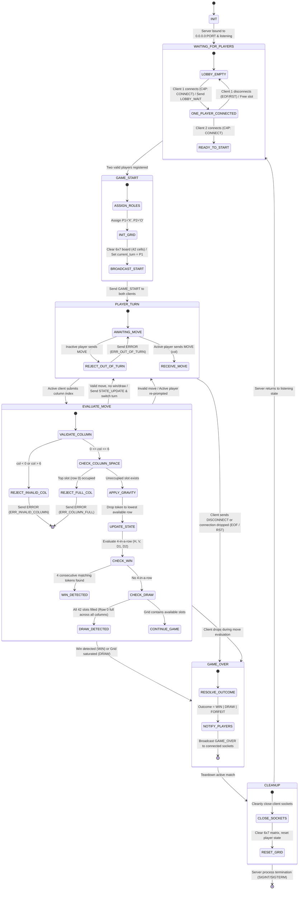

# Server-Side Finite State Machine (FSM) Specification: Connect 4 Engine
**Game:** Networked 2-Player Turn-Based Connect 4  
**Board Dimensions:** 6 Rows $\times$ 7 Columns (42 Slots)  
**Diagram Format:** Mermaid (`stateDiagram-v2`)  
**Target Environment:** Cisco Modeling Labs (CML) Multi-Subnet Architecture  

---

## 1. Complete Server State Transition Diagram

---

## 2. Server State Catalog & Operational Roles

| State Name | Operational Role | Acceptable Inbound Messages | Outbound Messages Generated |
| :--- | :--- | :--- | :--- |
| `INIT` | Initialize server socket, bind to `0.0.0.0:PORT`, setup non-blocking selector loop. | None | None |
| `WAITING_FOR_PLAYERS` | Accept incoming TCP handshakes; register client aliases into Player 1 and Player 2 slots. | `CONNECT`, `DISCONNECT` | `LOBBY_WAIT` |
| `GAME_START` | Assign `X` to Player 1 and `O` to Player 2, initialize the 6x7 board matrix, set initial turn. | None | `GAME_START` |
| `PLAYER_TURN` | Block on socket I/O for active player input; enforce turn boundaries against out-of-turn moves. | `MOVE`, `DISCONNECT` | None (or `ERROR` if out of turn) |
| `EVALUATE_MOVE` | Calculate gravity row drop $(r, c)$, verify 4-in-a-row vectors, inspect grid saturation. | None | `ERROR`, `STATE_UPDATE` |
| `GAME_OVER` | Resolve terminal game outcome (`WIN`, `DRAW`, `FORFEIT`), construct winning line coordinates. | None | `GAME_OVER` |
| `CLEANUP` | Close active peer sockets, purge match memory, reset lobby back to listening state. | None | TCP FIN teardown |

---

## 3. Game Engine Logic & State Handling Rules

### 3.1 Gravity-Based Drop Calculation
In Connect 4, players do not choose a row; they choose a column index $c \in [0, 6]$.
1. **Bounds Verification:** Ensure $0 \le c \le 6$. If out of range, dispatch `ERR_INVALID_COLUMN`.
2. **Column Saturation Check:** Check whether `board[0][c] != " "`. If true, the column is full; reject with `ERR_COLUMN_FULL`.
3. **Gravity Iteration:** Search upwards starting from the bottom row $r = 5$ to $r = 0$:
   $$\text{target\_row} = \max \{ r \in [0, 5] \mid \text{board}[r][c] = \text{" "} \}$$
4. **Token Placement:** Place the active player's assigned token: `board[target_row][c] = current_role`. Increment total move count.

### 3.2 Win & Draw Condition Algorithms
Following every successful piece placement at $(r, c)$ with token $S \in \{X, O\}$, the server evaluates:

1. **Horizontal Vector ($\leftrightarrow$):** Check for 4 matching consecutive tokens across row $r$ from column $c - 3$ to $c + 3$:
   $$\exists k \in [0, 3] : \bigwedge_{i=0}^3 \text{board}[r][c - k + i] = S$$
2. **Vertical Vector ($\updownarrow$):** Check downwards along column $c$. Since tokens drop from above, a vertical connect-4 only occurs downward:
   $$r \le 2 \land \bigwedge_{i=0}^3 \text{board}[r + i][c] = S$$
3. **Ascending Diagonal Vector (/):** Check along slope $\Delta r = -\Delta c$ spanning $(r+3, c-3)$ through $(r-3, c+3)$.
4. **Descending Diagonal Vector (\\):** Check along slope $\Delta r = \Delta c$ spanning $(r-3, c-3)$ through $(r+3, c+3)$.
5. **Draw Condition (Grid Full):** If no win is detected and total move count $= 42$ (or all cells in top row `board[0][0..6]` are not `" "`), transition to `GAME_OVER` with `outcome = "DRAW"`.
6. **Continuation:** If neither win nor draw condition is satisfied, toggle active turn to the opponent:
   $$\text{current\_turn} = (\text{current\_turn} == \text{P1}) \ ? \ \text{P2} : \text{P1}$$
   Dispatch `STATE_UPDATE` to both clients and return to `PLAYER_TURN`.

---

## 4. Error Handling, Edge Cases & Disconnect Transitions

### 4.1 Out-of-Turn Move Protection
- **Condition:** In state `PLAYER_TURN`, client `P2` sends a `MOVE` while `current_turn == P1`.
- **Handling:**
  - Transition to sub-state `REJECT_OUT_OF_TURN`.
  - Transmit an `ERROR` message with code `ERR_OUT_OF_TURN` exclusively to `P2`.
  - State machine returns immediately to `AWAITING_MOVE`.
  - The turn pointer remains on `P1`, and board state is unaltered.

### 4.2 Invalid Input Recovery
- **Condition:** The active player selects an out-of-bounds column ($c < 0$ or $c > 6$) or a saturated column (`board[0][c] != " "`).
- **Handling:**
  - Server transitions to `REJECT_INVALID_COL` or `REJECT_FULL_COL`.
  - An `ERROR` message (`ERR_INVALID_COLUMN` or `ERR_COLUMN_FULL`) is sent back to the active player.
  - The active player's turn is **not forfeit**; the state machine loops back to `PLAYER_TURN` allowing the player to select a valid column.

### 4.3 Graceful Disconnection (`DISCONNECT` Message)
- **Condition:** A connected player voluntarily quits by typing `quit` or `exit` in their CLI.
- **Handling:**
  - Client sends framed `DISCONNECT` message.
  - Server immediately transitions to `GAME_OVER`.
  - Server sets `outcome = "FORFEIT"` and declares the remaining connected player the winner (`winner_id = opponent_id`).
  - Broadcasts `GAME_OVER` to the remaining player and proceeds to `CLEANUP`.

### 4.4 Abrupt Network Drop & Socket Severance (EOF / RST)
- **Condition:** A client process is killed abruptly (`kill -9`), or link degradation/severance occurs in the CML virtual network.
- **Handling:**
  - Low-level `recv_exact()` detects 0-byte EOF (`b""`) or catches `ConnectionResetError` / `BrokenPipeError`.
  - If the drop occurs during `WAITING_FOR_PLAYERS`:
    - The server clears the occupied slot and resets the lobby to `LOBBY_EMPTY` without crashing.
  - If the drop occurs during an active match (`PLAYER_TURN` or `EVALUATE_MOVE`):
    - Server immediately transitions to `GAME_OVER`.
    - Server sets `outcome = "FORFEIT"` and `reason = "OPPONENT_DISCONNECTED"`.
    - Dispatches `GAME_OVER` to the surviving client socket.
    - Server transitions to `CLEANUP`, closes both sockets, flushes the 6x7 grid, and returns cleanly to `WAITING_FOR_PLAYERS` to await new connections.
